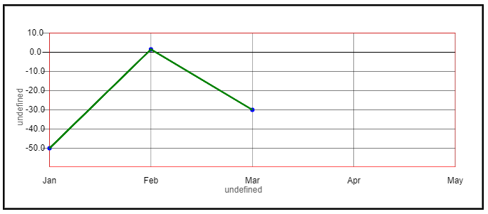

	HTML5 CANVAS를 이용한 line chart SDK

	파일 위치 : JChart/JChart.js

<section class="content">

# Usage - config

### [#](#config) 기본 config 설정

<section>기본적으로 config에 아무런 옵션이 없을 경우에도 표출이 된다. 그러나 의미있는 그래프를 그리기 위해서는 최소한  
다음과 같은 설정이 필요하다.  

  

</section>

</section>
